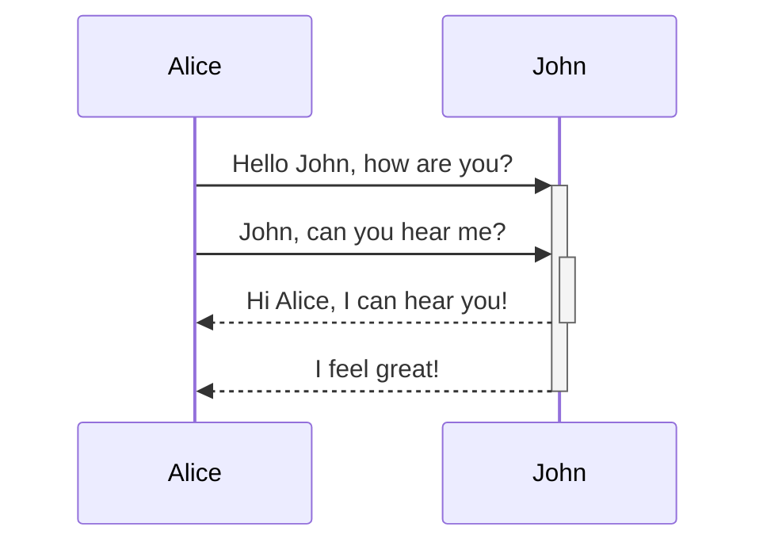

---
tags:
  - obsidian
draft: false
---

## Callouts

```
> [!info] Title
>
> This is a callout!
> 
> > [!info] Nested
> > 
> > Yes, they can!
```

图标不同，颜色不同，可以替换：

- info
- examples, example
- notes, note
- summaries, abstract, summary, tldr
- info, todo
- tip, hint, important
- success, check, done
- question, help, faq
- warning, caution, attention
- failure, fail, missing
- danger, error
- bug
- quote, cite

> [!quote] Quote
> 
> [Callouts](https://quartz.jzhao.xyz/features/callouts)

## Mermaid diagrams




> [!quote] Quote
> 
> [Mermaid diagrams](https://quartz.jzhao.xyz/features/Mermaid-diagrams)