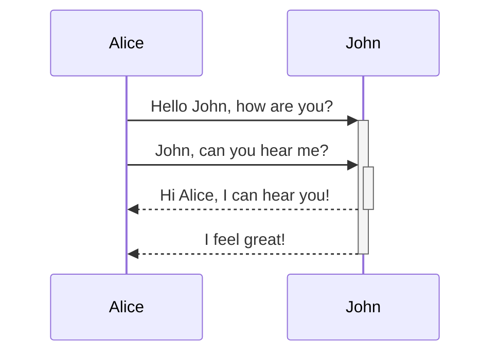

---
tags:
  - obsidian
draft: false
---

## Callouts

> [!note] Title
>
> This is a callout!
> 
> > [!warning] Nested
> > 
> > Yes, they can!

语法如下：

```
> [!note] Title
>
> This is a callout!
> 
> > [!tip] Nested
> > 
> > Yes, they can!
```

note, tip 可以替换，不同图标，不同颜色：

- info
- examples, example
- notes, note
- summaries, abstract, summary, tldr
- info, todo
- tip, hint, important
- success, check, done
- question, help, faq
- warning, caution, attention
- failure, fail, missing
- danger, error
- bug
- quote, cite

但建议只使用 GitHub 通用的 note, tip, important, warning, caution 这五个

## Mermaid diagrams

> [!quote] Quote
> 
> 具体语法可以参考 [Mermaid diagrams](https://quartz.jzhao.xyz/features/Mermaid-diagrams)



